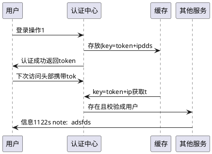
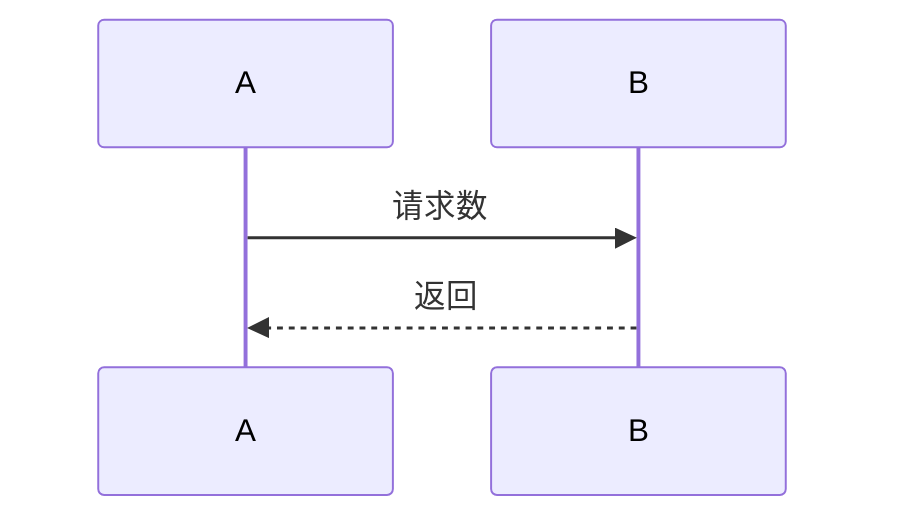
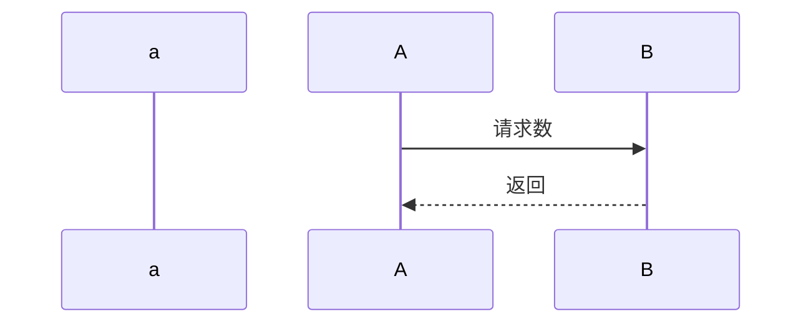

# aa

```shell
. ./esp-idf/export.sh
. ./esp-matter/export.sh
. ./connectedhomeip/scripts/activate.sh
```


```plantuml
@startuml
用户 -> 认证中心: 登录操作1
认证中心 -> 缓存: 存放(key=token+ipdds
用户 <- 认证中心 : 认证成功返回token
用户 -> 认证中心: 下次访问头部携带tok
认证中心 <- 缓存: key=token+ip获取t
其他服务 <- 认证中心: 存在且校验成用户
其他服务 -> 用户: 信息1122s note:  adsfds
@enduml
```


```mermaid
sequenceDiagram
  participant A
  participant B
  A ->> B : 请求数
  B -->> A : 返回
```


```mermaid
sequenceDiagram
participant a
participant A
participant B
  A ->> B : 请求数
  B -->> A : 返回
```
